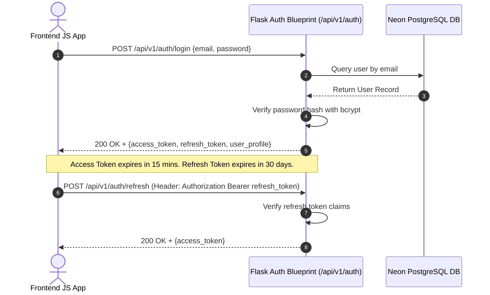

# Authentication Strategy & JWT Integration (Authentication.md)

## 1. Overview
This document specifies the authentication and authorization architecture for the Flask backend API. The system uses **JWT Tokens (Access + Refresh)** via `Flask-JWT-Extended` and password hashing with `bcrypt`.

---

## 2. Authentication Flow & Token Lifecycle



---

## 3. Flask JWT Implementation Blueprint (`app/api/auth.py`)

```python
from flask import Blueprint, request, jsonify
from flask_jwt_extended import create_access_token, create_refresh_token, jwt_required, get_jwt_identity
from werkzeug.security import generate_password_hash, check_password_hash
from app.extensions import db
from app.models.user import User

auth_bp = Blueprint("auth", __name__)

@auth_bp.route("/register", methods=["POST"])
def register():
    data = request.get_json() or {}
    email = data.get("email")
    username = data.get("username")
    password = data.get("password")

    if not email or not password or not username:
        return jsonify({"error": "Missing email, username, or password"}), 400

    if User.query.filter_by(email=email).first():
        return jsonify({"error": "User with this email already exists"}), 409

    user = User(
        username=username,
        email=email,
        password_hash=generate_password_hash(password)
    )
    db.session.add(user)
    db.session.commit()

    access_token = create_access_token(identity=user.id)
    refresh_token = create_refresh_token(identity=user.id)

    return jsonify({
        "message": "User registered successfully",
        "access_token": access_token,
        "refresh_token": refresh_token,
        "user": user.to_dict()
    }), 201

@auth_bp.route("/login", methods=["POST"])
def login():
    data = request.get_json() or {}
    email = data.get("email")
    password = data.get("password")

    user = User.query.filter_by(email=email).first()
    if not user or not check_password_hash(user.password_hash, password):
        return jsonify({"error": "Invalid email or password"}), 401

    access_token = create_access_token(identity=user.id)
    refresh_token = create_refresh_token(identity=user.id)

    return jsonify({
        "access_token": access_token,
        "refresh_token": refresh_token,
        "user": user.to_dict()
    }), 200
```

---

## 4. Protected Route & RBAC Middleware Pattern
```python
@game_bp.route("/submit", methods=["POST"])
@jwt_required()
def submit_score():
    current_user_id = get_jwt_identity()
    # Validate payload and record score for current_user_id
    return jsonify({"success": True, "score_recorded": True}), 200
```
