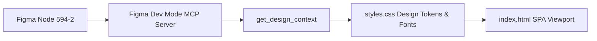

# Frontend Design System & Figma Integration (Designs.md)

## 1. Overview & Design Ingestion Workflow
The BlockRush UI is derived directly from Figma design node [`594-2`](https://www.figma.com/design/I0MbnU8Xks35mLwtkTcAKI/Projects?node-id=594-2). The design system relies on utility-first Tailwind CSS classes, custom CSS variables, and native JavaScript state management.



---

## 2. Core Color Palette Tokens

```css
:root {
  --bg-color: #000000;
  --text-color: #ffffff;
  --card-bg: #1d1e2c;       /* Dark Pill Buttons & Cards */
  --card-hover: #292a3e;
  --accent-yellow: #ffbd00;  /* Tile 2 / 32 / Active Highlights */
  --accent-pink: #9e0059;    /* Tile 1024 / 2048 / Primary Rush Button */
  --accent-orange: #ff5400;  /* Tile 4 / 256 / Master Level */
  --accent-cyan: #04c7fd;    /* Pro Level / Document Headings */
  --accent-purple: #390099;  /* Tile 16 / Accent Branding */
  --accent-red: #ff3b30;     /* Master Tier Badge */
}
```

---

## 3. Screen Component Guidelines

### 3.1 Main Menu View (`#screen-menu` / node `597:373`)
- **Brand Header**: BlockRush 6-block colored logo mark + 35px bold title.
- **Buttons**: `#1d1e2c` dark rounded pill buttons (`357px x 64px`), 20px font, left icon (`Start Playing`, `Challenge`, `Playground`).
- **Footer**: `Made with` Ghostofzenin brand logo + portal links (`BlockDocs Support`, `Terms & Conditions`).

### 3.2 Playground Math View (`#screen-playground-select` / node `600:773`)
- **Player Card**: Centered vertical stack (`#player0123`, shield avatar, `Increase Your Level of Math`, `#9e0059` rounded button `Rush the level`).
- **Mode Tiers**:
  - **Beginner**: `#ffbd00` title, `#9e0059` progress bar, `Level 0`.
  - **Pro**: `#04c7fd` title, `#0066ff` progress bar, `Level 0`.
  - **Master**: `#ff3b30` title, `#ff5400` progress bar, `Level 0`.

### 3.3 Weekly Challenge View (`#screen-weekly-challenge` / node `601:939`)
- **Header**: `← Challenge ❖`
- **Day Cards**: 5 rounded cards (`Day 1` active with checkmark `✓` and orange-to-purple gradient border; `Day 2`..`Day 5` locked tiles).

### 3.4 BlockDocs Support & Terms (`#screen-support` / node `622:1196` & `622:1365`)
- **Pill Sub-nav**: Scrollable tabs (`Support`, `How to play`, `About Game`, `Feedback & Suggestions`).
- **Developer Attribution**: `-Developers` with Ghostofzenin logo.
- **Query Form**: Full-width textarea with focus ring & `#1d1e2c` submit button.
