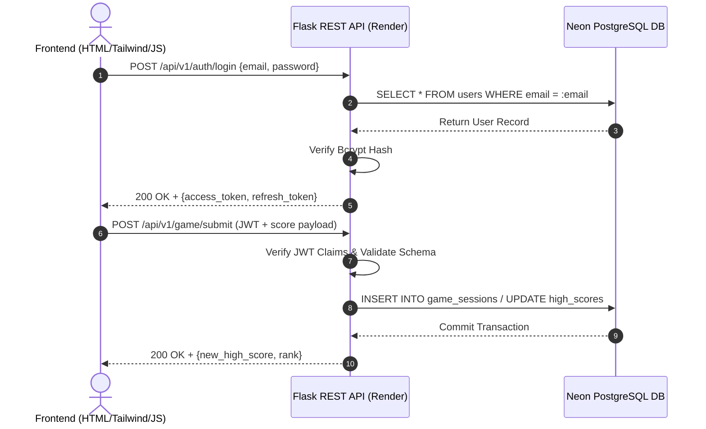

# Project Requirement Document (PRD.md) - Flask & BlockRush Engine

## 1. Executive Summary & Vision
This Project Requirement Document specifies the core requirements, architecture, and prompt engineering blueprints for building **BlockRush** using a **Flask Python backend API** and a **Web HTML5/Tailwind/JS frontend**. The system leverages serverless PostgreSQL on **Neon DB**, WSGI application serving via **Gunicorn on Render**, and **Vercel Edge CDN** for static frontend hosting.

---

## 2. Target Audience & Core Use Cases
- **Players / Gamers**: Users seeking high-performance 2048 block puzzle gameplay, weekly challenge modes, playground difficulty tiers, and online score tracking.
- **Backend Developers**: Teams building modular Flask Blueprints, Marshmallow validation schemas, and Flask-SQLAlchemy database ORM models.
- **Prompt Engineers**: AI coding agents requiring precise, structured prompt instructions for code generation, test writing, and security auditing.

---

## 3. Key Feature Specifications

### 3.1 Authentication & User Management
- **User Registration**: Username, Email, Password hashing using `bcrypt` / `werkzeug.security`.
- **JWT Authentication**: `Flask-JWT-Extended` providing Access Tokens (15 min expiry) and Refresh Tokens (30 days expiry).
- **Role-Based Access Control (RBAC)**: User, Admin, and Moderator permissions.

### 3.2 BlockRush Core Engine & Logic
- **Game Session Management**: REST endpoints to create, save, resume, and submit level scores (`/api/v1/game/submit`).
- **Playground Mode Levels**: Server-validated progress tracking for Beginner, Pro, and Master modes.
- **Weekly Challenge Engine**: Day 1 through Day 5 challenge progression and streak tracking.
- **Leaderboards**: High score aggregation and ranking API (`/api/v1/leaderboard`).

### 3.3 BlockDocs & Support System
- **Support FAQ & Documentation**: RESTful text endpoints serving BlockDocs Support, How to Play, Game Progress, and Game Controls content.
- **Query Submission**: `/api/v1/support/query` endpoint for submitting player inquiries with email notification integration.
- **Terms & Conditions**: Static legal document endpoints complying with 10 legal standards.

---

## 4. Core Building Logics & Data Flow

---

## 5. Non-Functional Requirements
- **Response Latency**: API endpoints respond under 120ms.
- **Availability**: 99.9% uptime target hosted on Render Web Services.
- **Security**: Mandatory HTTPS, CORS policies restricted to Vercel origins, prepared statements via SQLAlchemy to prevent SQL injection.
