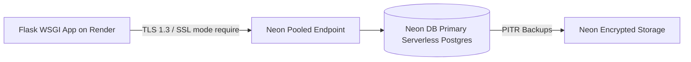

# Database Security & DLP Strategy (Security_db.md)

## 1. Neon PostgreSQL Database Security Architecture
The BlockRush database layer relies on **Neon DB serverless PostgreSQL**. All network traffic between Flask API endpoints on Render and Neon DB PostgreSQL servers is encrypted using **TLS 1.3**.



---

## 2. Neon DB Connection Security Rules
- **SSL Mode Requirement**: Connection strings MUST include `sslmode=require`.
- **Pooled Connections**: Use Neon PgBouncer pooled connection endpoint (`-pooler` hostname suffix) for stateless Flask Gunicorn workers.
- **Environment Variable Isolation**: Connection string stored in `DATABASE_URL` environment variable; never checked into version control.

---

## 3. SQL Injection Defense Guidelines
- **SQLAlchemy Parameterization**: All database queries must use SQLAlchemy ORM methods (`db.session.query()`, `filter_by()`, `filter()`).
- **Raw SQL Prevention**: If raw SQL is required, use `sqlalchemy.sql.text()` with bound parameters:
  ```python
  from sqlalchemy.sql import text
  
  # CORRECT: Bound parameters prevent SQL injection
  result = db.session.execute(
      text("SELECT * FROM users WHERE username = :name"),
      {"name": user_input}
  )
  ```

---

## 4. Neon DB Branching & Disaster Recovery Workflow
- **Development Branching**: Create isolated database branches on Neon for feature testing without modifying production data (`neon branch create feature-leaderboard`).
- **Point-in-Time Recovery (PITR)**: Restore database to any second within the retention window in case of emergency.
